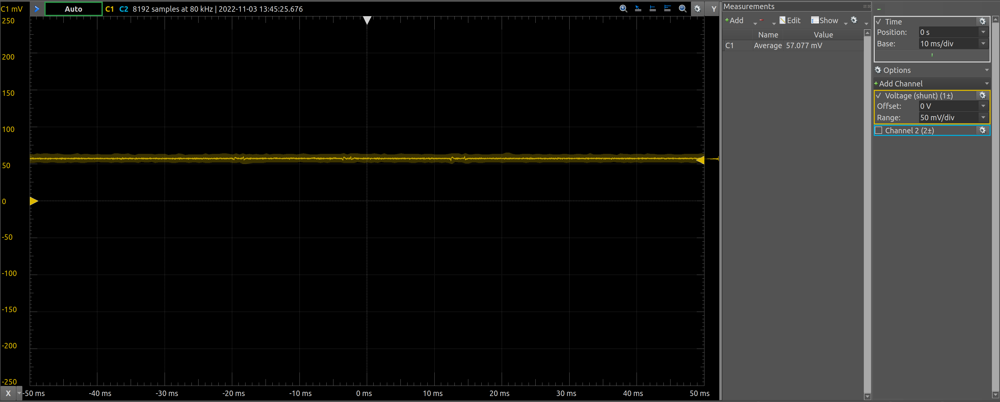
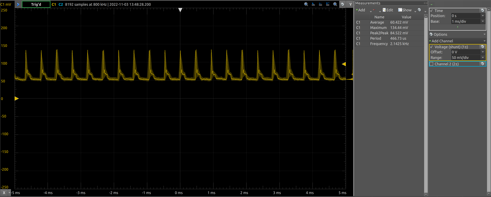
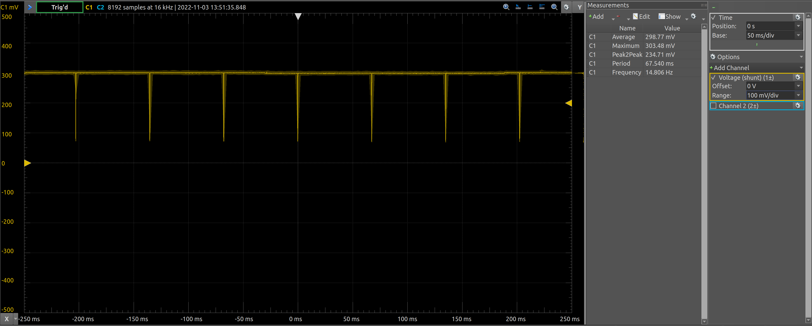

<!--
#
# Licensed to the Apache Software Foundation (ASF) under one
# or more contributor license agreements.  See the NOTICE file
# distributed with this work for additional information
# regarding copyright ownership.  The ASF licenses this file
# to you under the Apache License, Version 2.0 (the
# "License"); you may not use this file except in compliance
# with the License.  You may obtain a copy of the License at
#
# http://www.apache.org/licenses/LICENSE-2.0
#
# Unless required by applicable law or agreed to in writing,
# software distributed under the License is distributed on an
# "AS IS" BASIS, WITHOUT WARRANTIES OR CONDITIONS OF ANY
#  KIND, either express or implied.  See the License for the
# specific language governing permissions and limitations
# under the License.
#
-->

# Ultrawide Buffs - Low Power Development Sketch

Currently the microcontroller is drawing more current than expected. 

 - https://electronics.stackexchange.com/questions/499492/nrf52-gpio-configuration-in-sleep-mode-to-prevent-peripherals-from-drawing-curre
 - https://embeddedcentric.com/lesson-14-nrf5x-power-management-tutorial/

### Microcontroller Completely Erased (Voltage Across 2 ohm shunt)



 * Note there is ~ 26 mA of current coming from the USB circuit so this is really an offset measurement

### Bootloader Burned (Voltage Across 2 ohm shunt)



### TWR Example Code from Decawave Actively Running (Voltage Across 2 ohm shunt)



## Overview

This sketch contains code which simply put the microcontroller and the DWM1000 chip in the deepest sleep possible. 

Additionally, the sketch will put the battery fuel gauge into a low power mode.

It should be noted that for the given microcontroller (nRF52832) the microcontroller really only provides two sleep modes - ON/OFF. In the OFF (sleep state), the microcontroller requires external GPIO interupts in order to wake up again. As such in the final design it will be required to have the accelerometer or DWM1000 fire these interrupts, or switch to another microcontroller. As the framework (Apache Newt) that we are using supports a hardware abstraction layer, it is (*in theory*) possible to migrate the firmware to another microcontroller without significant software rework.

 - https://mynewt.apache.org/
 - https://mynewt.apache.org/v1_10_0/os/modules/hal/hal.html

## Fuel Guage Driver (BQ27441-g1)

A C driver for the Fuel Guage (BQ27441-g1) is also included in the project. 

The style of the driver mimics the functionality of a C++ class in C. Attributes of the fuel guage object are defined in the `Fuel_Guage_BQ27441-g1_t` stuct. This struct effectively mimics the functionality of the `this` pointer inside a class instance. All functions for the driver take the a pointer to a `Fuel_Guage_BQ27441-g1_t` as an arguements so they effectly act like a class.

The goal of the driver is to write it in such a way that it is agnostic of the target framework or MCU. Hardware specific details such as defining the I2C read/write semantics are not bound until compile time. The `Fuel_Guage_BQ27441-g1_t` contains function pointers which are set at compile-time defining `i2c_write_bytes` and `i2c_read_bytes`. 

## Documentation (Doxybuddy)

Documentation for the project is maintained with doxygen. Additionally, a custom wrapper script has been written around doxygen to pull from other sources as well as compile it using a open source css file to improve the appearance. 

To update the documentation run `bash doxybuddy.sh`

For now, the generated documentation is included in the `docs` folder. Simply open your file manager and open `docs/html/index.html` in your browser of choice. 

## Setup

```
newt target create ultrawidebuffs_power
newt target set ultrawidebuffs_power app=apps/ultrawidebuffs_power
newt target set ultrawidebuffs_power bsp=@decawave-uwb-core/hw/bsp/dwm1001
newt target set ultrawidebuffs_power build_profile=debug
# Uncomment next line to use uart instead of rtt console
#newt target amend ultrawidebuffs_power syscfg=CONSOLE_UART_BAUD=460800:CONSOLE_UART=1:CONSOLE_RTT=0
newt target amend ultrawidebuffs_power syscfg=UWB_TRANSPORT_ROLE=1:OS_LATENCY=1000:CONSOLE_UART_BAUD=115200:CONSOLE_UART=0:CONSOLE_RTT=1:DW1000_SYS_STATUS_BACKTRACE_LEN=128
newt run ultrawidebuffs_power 0
```

```
newt target create ultrawidebuffs_power
newt target set ultrawidebuffs_power app=apps/ultrawidebuffs_power
newt target set ultrawidebuffs_power bsp=@decawave-uwb-core/hw/bsp/dwm1001
newt target set ultrawidebuffs_power build_profile=optimized
# Uncomment next line to use uart instead of rtt console
newt target amend ultrawidebuffs_power syscfg=CONSOLE_UART_BAUD=460800:CONSOLE_UART=0:CONSOLE_RTT=0
newt build ultrawidebuffs_power
newt create-image ultrawidebuffs_power 1.0.0 
newt load ultrawidebuffs_power 0
```

